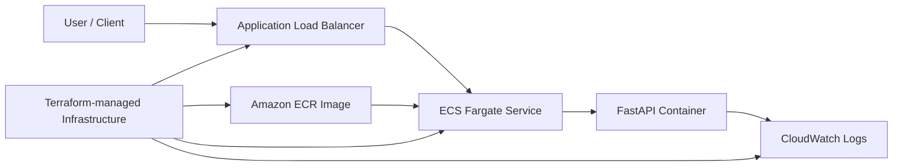

# Containerised App on ECS Fargate

This repository is a practical ECS Fargate Operational Readiness Lab. The current milestone demonstrates a small Python FastAPI service packaged with Docker, pushed to ECR, deployed on ECS Fargate, and exposed publicly through an Application Load Balancer in `eu-west-2`.

## Architecture overview

At this stage, the lab uses a straightforward AWS deployment path: a client sends HTTP requests to an Application Load Balancer, which forwards traffic to a single ECS Fargate service running the FastAPI container. The container image is pulled from Amazon ECR, application logs are sent to CloudWatch Logs, and the infrastructure is provisioned with Terraform.



This is intentionally a simple lab architecture for the current milestone, using the default VPC rather than a custom network design.

## What this demonstrates

This lab is designed to show practical cloud support and junior cloud engineering skills, including:

- containerisation of a small web service with Docker
- image publishing to Amazon ECR
- ECS Fargate deployment behind an Application Load Balancer
- ALB health-check verification and basic service validation
- CloudWatch log inspection for operational troubleshooting
- day-to-day Terraform workflow for provisioning and cleanup
- cost-aware teardown of live AWS resources after testing

## Local app

The application lives under `app/` and exposes:

- `GET /` for basic service information
- `GET /health` for container and ALB health checks
- `GET /version` for app version and build metadata

## Run locally with Docker

Build the image:

```bash
docker build -t ecs-fargate-lab ./app
```

Run the container:

```bash
docker run --rm -p 8000:8000 ecs-fargate-lab
```

Test the endpoints:

```bash
curl -i http://localhost:8000/
curl -i http://localhost:8000/health
curl -i http://localhost:8000/version
```

Optional build metadata can be passed at runtime:

```bash
docker run --rm -p 8000:8000 \
  -e APP_VERSION=0.1.0 \
  -e BUILD_ID=local \
  ecs-fargate-lab
```

## Current lab deployment milestone

This working lab milestone includes:

- a FastAPI app containerised with Docker
- an image pushed to Amazon ECR
- an ECS cluster, task definition, IAM roles, and CloudWatch log group
- an Application Load Balancer, target group, and HTTP listener
- an ECS Fargate service attached to the ALB target group
- successful public verification through the ALB using `GET /health`, `GET /`, and `GET /version`
- target group health confirmed as healthy
- ECS service confirmed as `ACTIVE` with `desiredCount` `1`, `runningCount` `1`, and `pendingCount` `0`
- CloudWatch log entries showing `/health` requests returning `200 OK`

This is a lab deployment milestone rather than a production-ready platform. It is intended to show hands-on delivery across container build, image publishing, ECS, IAM, logging, load balancing, and basic operational verification.

## Terraform: dev environment

```bash
cd infrastructure/environments/dev
terraform init
terraform fmt -recursive ../..
terraform validate
terraform plan
terraform apply
```

The dev environment provisions the current lab foundation, including ECR, ECS, IAM roles, CloudWatch logging, default VPC integration, the ALB, and the ECS Fargate service.

## Push image to ECR

Push the local image to the existing repository:
Replace `<aws_account_id>` with your AWS account ID before running these commands.

```bash
aws ecr get-login-password --region eu-west-2 | docker login --username AWS --password-stdin <aws_account_id>.dkr.ecr.eu-west-2.amazonaws.com
docker tag ecs-fargate-lab:latest <aws_account_id>.dkr.ecr.eu-west-2.amazonaws.com/ecs-fargate-readiness-lab:0.1.0
docker push <aws_account_id>.dkr.ecr.eu-west-2.amazonaws.com/ecs-fargate-readiness-lab:0.1.0
aws ecr describe-images --region eu-west-2 --repository-name ecs-fargate-readiness-lab --image-ids imageTag=0.1.0
```

In this lab, image tag `0.1.0` was used for the manual deployment milestone shown in the current documentation.

## Verify the deployment

Replace placeholders such as `<alb_dns_name>`, `<target_group_arn>`, and `<log_stream_name>` with your own environment values before running the commands.

Public endpoint checks through the ALB:

```bash
curl -i http://<alb_dns_name>/health
curl -i http://<alb_dns_name>/
curl -i http://<alb_dns_name>/version
```

Confirm target group health:

```bash
aws elbv2 describe-target-health \
  --region eu-west-2 \
  --target-group-arn <target_group_arn>
```

Confirm ECS service state:

```bash
aws ecs describe-services \
  --region eu-west-2 \
  --cluster ecs-fargate-readiness-lab-dev \
  --services ecs-fargate-readiness-lab-service
```

Inspect CloudWatch log streams:

```bash
aws logs describe-log-streams \
  --region eu-west-2 \
  --log-group-name /ecs/ecs-fargate-readiness-lab
```

Read recent application log events:

```bash
aws logs get-log-events \
  --region eu-west-2 \
  --log-group-name /ecs/ecs-fargate-readiness-lab \
  --log-stream-name <log_stream_name>
```

For a practical operational guide, see [docs/runbooks/ecs-fargate-troubleshooting.md](docs/runbooks/ecs-fargate-troubleshooting.md).

## Cost control

This lab keeps a live ECS service and an internet-facing ALB running after deployment. Destroy the dev environment after testing to avoid ongoing AWS charges.

```bash
cd infrastructure/environments/dev
terraform destroy
```
